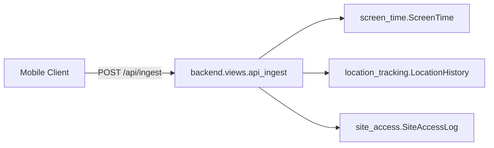
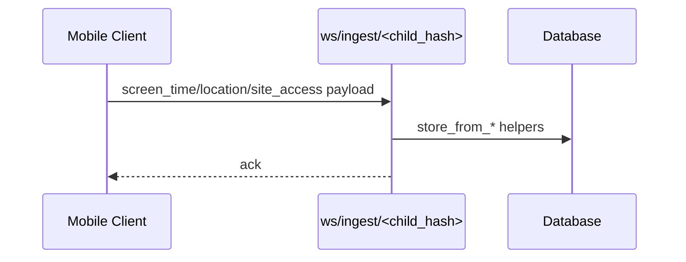
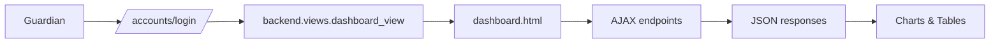
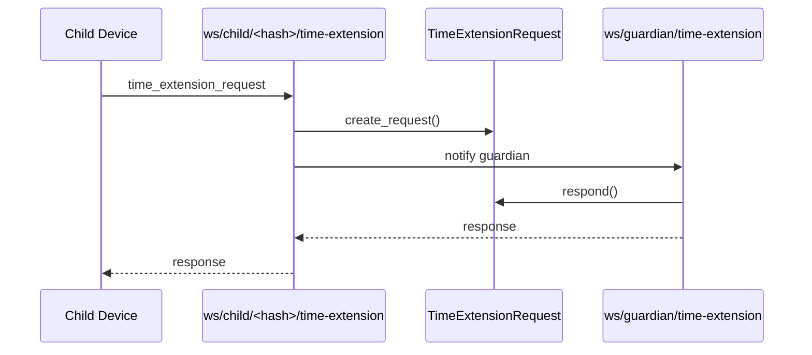

# Guardian AI Architecture

This document provides a comprehensive view of the Guardian AI backend architecture, its domain modules, data model, and the primary execution flows that power the parent dashboard and mobile integrations.

---

## 1. Platform Overview

Guardian AI is a Django-based parental control platform that collects device telemetry from child devices (screen time, app usage, location, and web activity), stores the data in a relational database (SQLite by default), and renders a guardian dashboard for monitoring and control. The backend is split into domain-focused Django apps to keep concerns isolated and enable independent evolution of each capability.

Key design goals:

- **Modularity**: screen time, location, site access, messaging, content risk, and document vault are separate apps.
- **Operational safety**: ownership checks for all guardian-visible data, retention pruning of telemetry.
- **Mobile-first APIs**: explicit mobile endpoints alongside dashboard endpoints.

---

## 2. Core Modules and Responsibilities

| Module | Location | Responsibilities |
|---|---|---|
| accounts | accounts/ | Guardian/child authentication, profiles, identity linking, and account UI. |
| screen_time | screen_time/ | Screen time aggregation, app usage analytics, restrictions, exam mode, and daily limits. |
| location_tracking | location_tracking/ | Location history APIs and filtering. |
| site_access | site_access/ | Website access logs and allowed/blocked signals. |
| messaging | messaging/ | E2E chat, time-extension requests, unread counts, and tasks. |
| content_risk | content_risk/ | Content risk logs for image/text/behavior signals. |
| document_vault | document_vault/ | Secure document storage with folder hierarchy (local/S3). |
| backend | backend/ | Dashboard rendering, core ingestion endpoints, AI insights, and compatibility imports. |
| guardianAI | guardianAI/ | Project settings and URL routing. |

---

## 2.1 Project Structure (Detailed)

The repository is organized into domain apps plus shared infrastructure. Below is a detailed map of the key directories and what they contain.

- **accounts/**: Authentication and account management.
  - **models.py**: `Guardian` and `Child` models, including RSA keypair fields and restrictions/limits.
  - **views.py**: Signup/login flows, child management, and dashboard entry points.
  - **urls.py**: Account routes (login, signup, child management actions).
  - **templates/**: Login/registration pages and dashboard shell templates.

- **screen_time/**: Screen time data and app usage.
  - **models.py**: `ScreenTime`, `AppScreenTime`, and `App` models.
  - **views.py**: Dashboard chart/stat endpoints, mobile API endpoints (trend, app usage, restricted apps, exam mode, daily limit).
  - **urls.py**: Routes for dashboard data and mobile endpoints.

- **location_tracking/**: Location history.
  - **models.py**: `LocationHistory` with retention pruning.
  - **views.py**: Dashboard locations endpoint and mobile location history endpoint.
  - **urls.py**: Routing for location APIs.

- **site_access/**: Web activity monitoring.
  - **models.py**: `SiteAccessLog` with retention pruning.
  - **views.py**: Dashboard site logs and mobile site access endpoints.
  - **urls.py**: Routing for site access APIs.

- **messaging/**: Encrypted messaging and coordination.
  - **models.py**: `ChatMessage`, `TimeExtensionRequest`, and task models.
  - **views.py**: Public key APIs, chat APIs, time-extension APIs, unread counts, and tasks APIs.
  - **consumers.py**: WebSocket consumers for time-extension requests.
  - **routing.py**: WebSocket URL routes for messaging.
  - **urls.py**: REST endpoints for messaging and tasks.

- **content_risk/**: Content risk signals.
  - **models.py**: `ContentRiskLog` to store detection events.
  - **views.py/urls.py**: APIs for risk logs (if enabled).

- **document_vault/**: Secure document storage.
  - **models.py**: `Folder` and `Document` models.
  - **storage.py**: Local/S3 storage backend selection.
  - **validators.py**: File validation utilities.
  - **views.py/urls.py**: Document vault API endpoints and views.

- **backend/**: Core coordination and compatibility layer.
  - **views.py**: Dashboard rendering, ingestion APIs, AI insights, and mobile metric aggregation.
  - **consumers.py**: WebSocket ingestion for real-time telemetry.
  - **routing.py**: WebSocket URL routes for ingestion.
  - **models.py**: Backwards-compatible imports for refactored domain models.

- **guardianAI/**: Project configuration.
  - **settings.py**: Django settings, installed apps, middleware, and external keys.
  - **urls.py**: Root URL routing to app modules.
  - **asgi.py/wsgi.py**: Deployment entry points.

- **staticfiles/**: Collected static assets for production (via `collectstatic`).
- **templates/**: Shared HTML templates and dashboard components.
- **manage.py**: Django management entry point.
- **requirements.txt**: Python dependencies.

---

## 3. Data Model Summary

### 3.1 Identity & Access (accounts)

- **Guardian**: Email-based login, linked to children via many-to-many relationship; contains RSA keypair fields for E2E messaging.
- **Child**: Identified by `child_hash`; stores app restrictions, daily limits, exam mode flags, and RSA keypair fields.

### 3.2 Telemetry (screen_time, location_tracking, site_access)

- **ScreenTime**: Daily aggregate per child; retains legacy `app_wise_data` for compatibility.
- **AppScreenTime**: Hourly, per-app usage linked to ScreenTime.
- **App**: App catalog with metadata and icon URLs.
- **LocationHistory**: GPS points with 365‑day retention pruning.
- **SiteAccessLog**: Allowed/blocked web access logs with retention pruning.

### 3.3 Messaging & Requests (messaging)

- **ChatMessage**: E2E encrypted messages between guardian and child.
- **TimeExtensionRequest**: Child requests extra time for restricted apps; guardian responds.
- **Task**: Guardian-created tasks assigned to a child.

### 3.4 Safety & Storage

- **ContentRiskLog**: Image/text/behavior risk scores per child event.
- **Folder**, **Document**: Document vault hierarchy and storage metadata (local/S3).

---

## 4. Execution Flows

### 4.1 HTTP Ingestion (Mobile → Server)

Mobile clients POST telemetry to `/api/ingest/`. The view routes payload sections to domain helpers:

- `ScreenTime.store_from_dict()`
- `LocationHistory.store_from_dict()`
- `SiteAccessLog.store_from_list()`



### 4.2 Real-Time Ingestion (WebSocket)

WebSocket ingestion supports near real-time telemetry (screen time, location, site access). The consumer validates `child_hash` and writes to the same helpers.



### 4.3 Dashboard Rendering (Web UI)

The dashboard is rendered by `backend.views.dashboard_view`. It aggregates per-child metrics and supplies a template context used by reusable components. Charts and tables are populated via AJAX endpoints from domain apps.



### 4.4 Time Extension Requests (WebSocket + REST)

Children request extra time via WebSocket; guardians respond via WebSocket or REST endpoints. Requests are stored in `TimeExtensionRequest`.



---

## 5. Routing Overview

### Backend (core)

- `/dashboard/` (dashboard UI)
- `/api/login/`, `/api/signup/`, `/api/ingest/`
- `/api/mobile/children/`, `/api/mobile/child/<hash>/metrics/`
- `/api/child/<hash>/ai-ask/` (AI insights)

### Screen Time

- `/dashboard/chart-data/<hash>/`, `/dashboard/stats/<hash>/`
- `/api/blocked-apps/<hash>/`, `/api/blocked-apps/<hash>/update/`
- `/api/mobile/child/<hash>/screen-time/`, `/api/mobile/child/<hash>/app-usage/`
- `/api/mobile/child/<hash>/restricted-apps/`, `/api/mobile/child/<hash>/exam-mode/`
- `/api/mobile/child/<hash>/daily-limit/`, `/api/child/<hash>/daily-limit/`

### Location Tracking

- `/dashboard/locations/<hash>/`, `/api/mobile/child/<hash>/locations/`

### Site Access

- `/dashboard/site-logs/<hash>/`, `/api/mobile/child/<hash>/site-access/`

### Messaging

- Public key APIs, time extension APIs, chat APIs, unread counts, and tasks

### WebSocket Routing

- `ws/ingest/<child_hash>/` and `ws/ingest-auth/`
- `ws/child/<child_hash>/time-extension/` and `ws/guardian/time-extension/`

---

## 6. External Services

- **OpenCage**: reverse-geocoding for latest-location display.
- **Google Play Scraper**: app metadata and icon retrieval.
- **Document Vault Storage**: local filesystem or S3 (config-driven).

---

## 7. Security and Data Retention

- Guardian-facing views require `@login_required` and enforce guardian–child ownership.
- Mobile APIs use header-based authentication; child-device endpoints use `child_hash` where appropriate.
- Web UI POSTs are CSRF-protected; mobile endpoints are CSRF-exempt by design.
- Telemetry models prune records older than 365 days to limit retention.
- Messaging content is encrypted end‑to‑end; the server stores ciphertext only.

---

## 8. Extensibility Notes

- Add new telemetry by introducing a model + `store_from_dict` helper and wiring it into ingestion and dashboard summaries.
- Migrate storage backends by adjusting `DATABASES` settings and running migrations.
- Extend the dashboard via template components and the existing AJAX endpoints.

---

## 9. Quick Reference Diagram

```
Mobile Client  →  /api/ingest/  →  store_from_* helpers
        |                         →  ScreenTime / AppScreenTime
        |                         →  LocationHistory
        |                         →  SiteAccessLog
        |
Guardian login → dashboard_view → children_data → dashboard.html
        |
        └─ AJAX → chart/stats/locations/site-logs → JSON → UI
```
