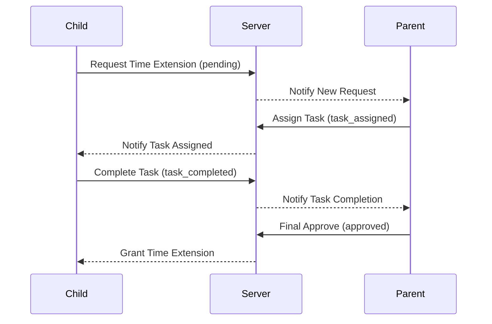

# Gamified Permission System API Guide (Task 2)

This document specifies the enhanced API flow for the "Gamified Permission System," where time extension requests are linked to task completion.

## 1. Request States
A `TimeExtensionRequest` now operates through the following lifecycle states, distinct from the general task list. Reward-linked tasks are transient and specifically tied to a permission lifecycle.

| State | Description |
|---|---|
| `pending` | Initial request from child. |
| `task_assigned` | Parent has assigned a **Reward Task**; permission is locked until completion. |
| `task_completed` | Child has completed the **Reward Task**. |
| `approved` | Final approval given; time is added to child's device. |
| `denied` | Request rejected by parent. |

---

## 2. Updated API Endpoints

### A. Get Suggested Reward Tasks
Used to populate the list shown in the storyboard (e.g., "Play Chess", "Exercise").

- **Endpoint:** `GET /api/mobile/time-extension-requests/suggested-tasks/`
- **Headers:** `X-Email`, `X-Password`
- **Response:**
```json
{
  "status": "ok",
  "suggested_tasks": [
    {"id": "play_chess", "title": "Play Chess", "description": "Engage in a game of chess"},
    {"id": "exercise", "title": "Exercise for 20 mins", "description": "Do some light stretching or cardio"},
    {"id": "read", "title": "Read Newspaper", "description": "Read at least three major articles"}
  ]
}
```

### B. Assign Reward Task to Request
Distinct from the general `/api/mobile/child/<child_hash>/tasks/` endpoint. These are "Reward-Link" entries.

- **Endpoint:** `POST /api/mobile/time-extension-requests/<request_id>/assign-task/`
- **Headers:** `X-Email`, `X-Password`
- **Body:**
```json
{
  "suggestion_id": "play_chess",
  "is_custom": false
}
```
*OR for a new custom reward task:*
```json
{
  "is_custom": true,
  "task_title": "Custom Task",
  "task_description": "Custom Description"
}
```
**Response:** Success status; request moves to `task_assigned`.

---

### B. Approve Without Task
Used if the parent chooses the **No Task** option or gives final approval after task completion.

- **Endpoint:** `POST /api/mobile/time-extension-requests/<request_id>/approve/`
- **Headers:** `X-Email`, `X-Password`
- **Body:**
```json
{
  "granted_hours": 1.5
}
```
**Response:** Success status; request moves to `approved`.

---

### C. Child Task Completion (Existing endpoint updated)
When a child completes an assigned task, the server automatically checks for linked permission requests.

- **Endpoint:** `POST /api/mobile/child/<child_hash>/tasks/<task_id>/complete/`
- **Behavior:** 
  1. Marks task as complete.
  2. If task is linked to a time extension, updates request status to `task_completed`.
  3. Sends a real-time notification to the parent's dashboard.

---

## 3. Real-time Notifications (WebSocket)

### New Event: `request_status_update`
Sent to the parent when a child completes an assigned task.
```json
{
  "type": "request_status_update",
  "data": {
    "request_id": 456,
    "status": "task_completed",
    "child_name": "Arun",
    "task_title": "Exercise for 20 minutes"
  }
}
```

---

## 4. Flow Diagrams

### Sequential Approval Flow

